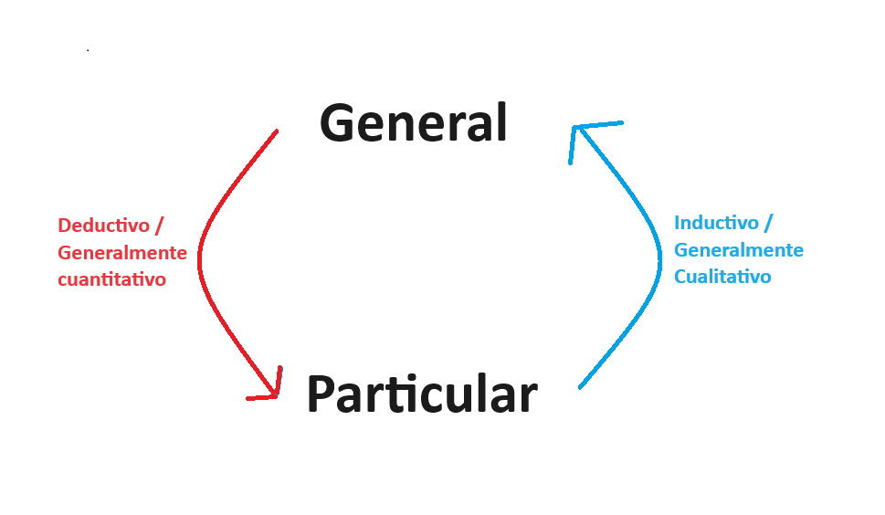
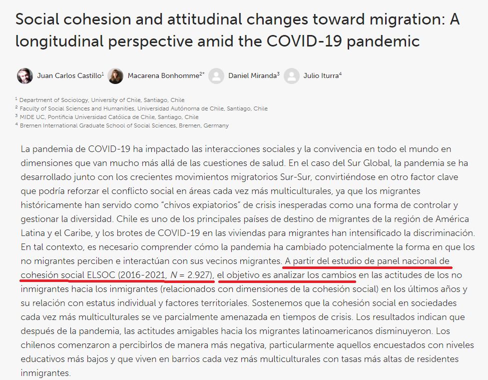
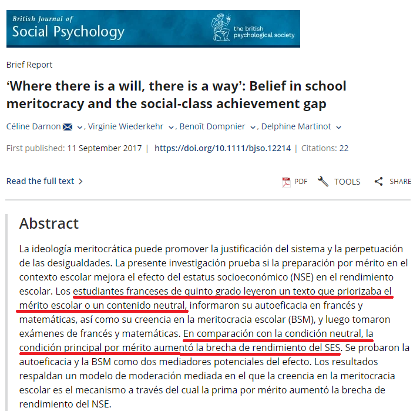

class: front

```{r eval=FALSE, include=FALSE}
# Correr esto para que funcione el infinite moonreader, el root folder debe ser static para si dirigir solo "bajndo" en directorios hacia el bib y otros

xaringan::inf_mr('/static/docpres/02_bases/2mlmbases.Rmd')

o en RStudio:
  - abrir desde carpeta root del proyecto
  - Addins-> infinite moon reader
```


```{r setup, include=FALSE, cache = FALSE}
require("knitr")
options(htmltools.dir.version = FALSE)
pacman::p_load(RefManageR)
# bib <- ReadBib("../../bib/electivomultinivel.bib", check = FALSE)
opts_chunk$set(warning=FALSE,
             message=FALSE,
             echo=FALSE,
             cache = FALSE, fig.width=7, fig.height=5.2)
pacman::p_load(flipbookr, tidyverse)
```


```{r xaringanExtra, include=FALSE}
xaringanExtra::use_xaringan_extra(c("tile_view", "animate_css"))
xaringanExtra::use_scribble()
```

<!---
Para correr en ATOM
- open terminal, abrir R (simplemente, R y enter)
- rmarkdown::render('static/docpres/07_interacciones/7interacciones.Rmd', 'xaringan::moon_reader')

About macros.js: permite escalar las imágenes como [scale 50%](path to image), hay si que grabar ese archivo js en el directorio.
--->


.pull-left[
# R para el análisis de datos
## **Kevin Carrasco**
## Sociología - UAH
## 1er Sem 2024 
## [.green[R-data-analisis.netlify.com]](https://R-data-analisis.netlify.com)
] 


.pull-right[
.right[
<br>
## .yellow[Sesión 3: Introducción a la investigación cuantitativa]


]

]
---

layout: true
class: animated, fadeIn


---
class: inverse, bottom, right, animated, slideInRight


# .red[Sesión 3]
<br>

Repaso sesión anterior

Introducción y bases de la investigación cuantitativa

Datos y variables

Niveles de medición

<br>
<br>
<br>
<br>
---
class: inverse, bottom, right


# .red[Sesión 3]
<br>

.yellow[Repaso sesión anterior]

Introducción y bases de la investigación cuantitativa

Datos y variables

Niveles de medición

<br>
<br>
<br>
<br>
---
# Comentarios trabajo 1

.center[¿Dudas, experiencias, problemas, sugerencias?]

---

# Estructura de carpetas


---

# Repositorio


---

# Github pages


---

# Reproducibilidad
--

- Es la posibilidad de **regenerar** de manera independiente los resultados usando los materiales originales de una investigación ya publicada.

- En términos simples: obtener los mismos resultados de una investigación utilizando los mismos datos.

---

## Ciencia abierta

<br>


---
class: center

## Protocolo de trabajo reproducible


.small[.right[fuente: [lisa-coes.com/ipo-repro](https://lisa-coes.com/ipo-repro)]]

---
class: inverse, bottom, right

# .red[Sesión 3]
<br>

Repaso sesión anterior

.yellow[Introducción y bases de la investigación cuantitativa]

Datos y variables

Niveles de medición

<br>
<br>
<br>
<br>
---

# Introducción y bases de la investigación cuantitativa

* Ciencia como método de investigación

* Permite lidiar con la **incertidumbre**

* Foco en la teoría

* Explicar lo que es, no lo que debería ser

* Conocer y explicar grupos de personas de manera general, no individuos por sí solos (inductivo/deductivo)

---

# Introducción y bases de la investigación cuantitativa



---

# Introducción y bases de la investigación cuantitativa

* Diseños de investigación transversal

* Diseños de investigación longitudinal

* Diseños de investigación experimentales

---
* Diseños de investigación transversal

.center[

]
---
* Diseños de investigación longitudinal

.center[

]

---
* Diseños de investigación experimentales
.center[

]

---
class: inverse, bottom, right

# .red[Sesión 3]
<br>

Repaso sesión anterior

Introducción y bases de la investigación cuantitativa

.yellow[Datos y variables]

Medidas de tendencia central

<br>
<br>
<br>
<br>

---
##.yellow[Datos] y variables

* Los datos miden al menos una *característica* de a los menos una *unidad*  en a lo menos *un punto en el tiempo*

--
 + Ejemplo: La esperanza de vida en Chile el 2017 fue de 79,9 años

   - Característica (variable) : esperanza de vida

   - Unidad: Años

   - Punto en el tiempo: 2017

---
##.yellow[Datos] y variables

* Base de Datos

* Forma "rectangular" de almacenamiento de datos:

.center[]

---
##.yellow[Datos] y variables

  - cada .blue[fila] representa una unidad o caso (ej: un entrevistad_)

  - cada .orange[columna] una variable (ej: edad)

  - cada .purple[variable] posee valores numéricos

  - los valores numéricos pueden estar asociados a una etiqueta (ej: 1=Mujer)
  
---
##.yellow[Datos] y variables

### Ejemplos de estudios / bases de datos

1. [Encuesta Centro de Estudios Públicos](https://www.cepchile.cl/cep/site/edic/base/port/encuestacep.html)

2. [Encuesta CASEN](http://observatorio.ministeriodesarrollosocial.gob.cl/casen-multidimensional/casen/casen_2017.php)

3. [Encuesta Lapop](https://www.vanderbilt.edu/lapop-espanol/)

4. [ELSOC](https://coes.cl/encuesta-panel/)

---
## Datos y .yellow[variables]

- Una variable representa cualquier cosa o propiedad que varia y a la cuál se le asigna un valor. Es decir:

- $Variable \neq Constante$

- Pueden ser visibles o no visibles/latentes. (Ej: peso / inteligencia)

---
## Datos y .yellow[variables]

- discretas (Rango finito de valores):

      - Dicotómicas
      - Politómicas

- continuas:

      - Rango (teóricamente) infinito de valores.

---
## Escalas de medición de variables

- NOIR: Nominal, Ordinal, Intervalar, Razón

.small[
| Tipo       	| Características                     	        | Propiedad de números 	| Ejemplo|
|------------	|----------------------------------------------|---------------	|-----------	|
| *Nominal*    	| Uso de números en lugar de palabras 	| Identidad            	| Nacionalidad      	|
| *Ordinal*    	| Números se usan para ordenar series 	| + ranking            	| Nivel educacional 	|
| *Intervalar* 	| Intervalos iguales entre números    	| + igualdad           	| Temperatura       	|
| *Razón*      	| Cero real                           	| + aditividad         	| Distancia         	|
]


---
class: inverse, bottom, right

# .red[Sesión 3]
<br>

Repaso sesión anterior

Introducción y bases de la investigación cuantitativa

Datos y variables

.yellow[Medidas de tendencia central]

<br>
<br>
<br>
<br>

---

## Medidas de tendencia Central

* **Moda**: valor que ocurre más frecuentemente

--

* **Mediana**: valor medio de la distribución ordenada. Si N es par, entonces es el promedio de los valores medios

--
* **Media** o promedio aritmético: suma de los valores dividido por el total de casos

---
## Medidas de tendencia Central

### Dispersión:

* **Varianza**: promedio de la suma de las diferencias del promedio al cuadrado

* **Desviación Estándar**:
  - Raiz Cuadrada de la varianza.

  - Expresada  en la mismas unidades que los puntajes de la escala original

---
class: middle, center

# Más sobre datos, variables y varianza en:

##-  [Moore: 1.Comprensión de los datos (1-54)](https://multivariada.netlify.app/docs/lecturas/moore_comprensiondelosdatos.pdf)


---
## Recodificación de datos en R

Guía de trabajo en:

# .center[[**https://r-data-analisis.netlify.app/practicos/03-content**](https://r-data-analisis.netlify.app/practicos/03-content)]

---


class: front

.pull-left[
# R para el análisis de datos
## **Kevin Carrasco**
## Sociología - UAH
## 1er Sem 2024 
## [.green[R-data-analisis.netlify.com]](https://R-data-analisis.netlify.com)
] 


.pull-right[
.right[
<br>
## .yellow[Sesión 1: Introducción]


]

]
