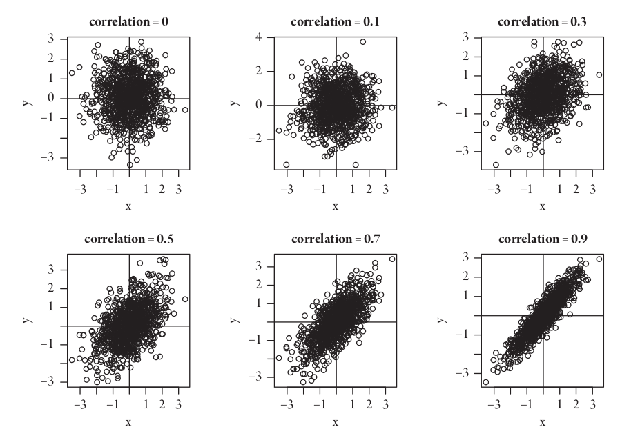

class: front

```{r eval=FALSE, include=FALSE}
# Correr esto para que funcione el infinite moonreader, el root folder debe ser static para si dirigir solo "bajndo" en directorios hacia el bib y otros

xaringan::inf_mr('/static/docpres/02_bases/2mlmbases.Rmd')

o en RStudio:
  - abrir desde carpeta root del proyecto
  - Addins-> infinite moon reader
```


```{r setup, include=FALSE, cache = FALSE}
require("knitr")
options(htmltools.dir.version = FALSE)
pacman::p_load(RefManageR)
# bib <- ReadBib("../../bib/electivomultinivel.bib", check = FALSE)
opts_chunk$set(warning=FALSE,
             message=FALSE,
             echo=FALSE,
             cache = FALSE #,fig.width=7, fig.height=5.2
             )
pacman::p_load(flipbookr, tidyverse)
```


```{r xaringanExtra, include=FALSE}
xaringanExtra::use_xaringan_extra(c("tile_view", "animate_css"))
xaringanExtra::use_scribble()
```

<!---
Para correr en ATOM
- open terminal, abrir R (simplemente, R y enter)
- rmarkdown::render('static/docpres/07_interacciones/7interacciones.Rmd', 'xaringan::moon_reader')

About macros.js: permite escalar las imágenes como [scale 50%](path to image), hay si que grabar ese archivo js en el directorio.
--->


.pull-left[
# Metodología I
## **.yellow[Juan Carlos Castillo]**
## Magister Ciencias Sociales FACSO - UChile
## 1er Sem 2023 
## [.green[metod1-mcs.netlify.com]](https://metod1-mcs.netlify.com)
] 
    

.pull-right[
.right[
<br>
## .yellow[Sesión 5: Correlación]


]

]
---

layout: true
class: animated, fadeIn

---
class: inverse, bottom, right, animated, slideInRight

# Resumen clase anterior

---
.pull-left-narrow[


]
.pull-right-wide[

## Conceptos claves de inferencia
- La **inferencia** en estadística se refiere a la relación que existe entre los resultados obtenidos basados en nuestra muestra y la población

{{content}}

]

--

- **¿En qué medida podemos hacer inferencias desde nuestra muestra a la población?**

{{content}}

--

- Un concepto central es la probabilidad de **ERROR**


---
# Error estándar


---

# Error estándar

- ¿Cómo calculamos el error estándar a partir de **una** muestra?

- Basados en el **teorema del límite central**, en muestras mayores a 30 la desviación estándar de los promedios (error estándar) equivale a:

$$\sigma_{\bar{X}}=SE(error estándar)=\frac{s}{\sqrt{N}}$$

---
# Error, rangos y probabilidad


.pull-left[
.center[]]


.pull-right[
.medium[

- Por ejemplo, $\bar{x}$ +/- 2 SE abarca aproximadamente el 95% de los valores probables

- De otra manera, puedo dar un rango de valores donde se encuentra el promedio(+- 2 SE), con un nivel de confianza de 95%

- ... o con una probabilidad de error p<0.05

]
]


---
.pull-left-narrow[
# Inferencia y significación estadística
]

.pull-right-wide[
- ¿Con qué nivel de **probabilidad** estamos dispuest_s a aceptar que las diferencias (entre promedios) son distintas de 0?
]

--

.pull-right-wide[
- Por convención, una probabilidad de error (o valor *p*) de menos de 0.05 (1 de 20 veces)
]

--

.pull-right-wide[
- Esto significa una probabilidad de acierto/nivel de confianza de 95% (2 SE)
]

---

## Inferencia, diferencias y prueba _t_

.medium[
- La prueba _t_ se utiliza para inferencias sobre diferencias de promedios  y básicamente es una razón entre

.center[]

- Ya que la diferencia esperada si $H_0$ es verdadera es 0, entonces:

$$t=\frac{\bar{X}_a -  \bar{X}_b}{SE(\bar{X}_a -  \bar{X}_b)}$$
]


---

# Valor crítico de T

- para simplificar, básicamente se utilizan 2 valores críticos de T / Z: 
  - 1.96 para un $\alpha=0.05$
  - 2.58 para un $\alpha=0.01$

- por lo tanto, si el la diferencia de promedios se divide por el error estándar y da más que **1.96**, entonces es estadísitcamente significativo con una probabilidad de error **p <0.05**, y si es mayor de **2.58** es estadísitcamente significativo con una probabilidad de error **p <0.01**

---
class: inverse, bottom, right, animated, slideInRight

# Correlación

---
# Explorando asociaciones

- la mayor parte de las teorías conlleva relaciones entre un fenómeno y otro

- ¿Cómo podemos medir la asociación entre variables?


---
# Varianza & desviación estándar
.pull-left[
  
  .small[
    
    | ID   | Pje (x) | $$x-\bar{x}$$ | $$(x-\bar{x})^{2}$$ |
      |------|---------|----------|-----------|
      | 1    | 6       | 0.4      | 0.16      |
      | 2    | 4       | -1.6     | 2.56      |
      | 3    | 7       | 1.4      | 1.96      |
      | 4    | 2       | -3.6     | 12.96     |
      | 5    | 9       | 3.4      | 11.56     |
      | Sum  | 28      | 0        | 29.2      |
      | Prom | 5.6     |          |           |
      
  ]
]

.pull-right[

\begin{align*}
Varianza =\sigma^{2} &={\sum_{i=1}^{N}(x_{i}-\bar{x})^{2}\over {N - 1}}\\
\sigma^{2} &={(29.2)\over {5 - 1}}\\
\sigma^{2} &= 7.3 \\
Desv.est=\sigma &=\sqrt(7.3) \\
\sigma &= 2,7
\end{align*}
]

---
# Asociación: covarianza / correlación

.pull-left[
  _¿Se relaciona la variación de una variable, con la variación de otra variable?_
]
.pull-right[
.center[]
]
---
# Asociación: covarianza / correlación (II)

\begin{align*}
Covarianza = cov(x,y) &= \frac{\sum_{i=1}^{n}(x_i - \bar{x})(y_i - \bar{y})} {n-1}\\
\\
Correlación=r &= \frac{\sum_{i=1}^{n}(x_i - \bar{x})(y_i - \bar{y})} {(n-1)\sigma_x \sigma_y }\\ \\
alternativamente=r &= \frac{\sum(x-\bar{x})(y-\bar{y})}{\sqrt{\sum(x-\bar{x})^{2} \sum(y-\bar{y})^{2}}}
\end{align*}


---
# Correlación

- medida de asociación lineal entre variables

- estandarizada

- varía entre -1 y +1:

  - positiva: a medida que aumenta una, aumenta la otra

  -     negativa: a medida que aumenta una, disminuye la otra

  - cero: no hay evidencia de asociación lineal entre las variables


---

.pull-left-narrow[
.left[
### Ejemplo de correlación de Pearson
$r= \frac{\sum(x-\bar{x})(y-\bar{y})}{\sqrt{\sum(x-\bar{x})^{2} \sum(y-\bar{y})^{2}}}$
$$=\frac{-63}{\sqrt{210*68}}$$
$$=-0.5272$$
]
]


.pull-right-wide[
.tiny[
  <br>
    
| id| x  | y  | (A) $$x-\bar{x}$$ | (B) $$y-\bar{y}$$ | A*B | $$(x-\bar{x})^{2}$$ | $$(y-\bar{y})^{2}$$ |
|---:|---:|---:|--------:|--------:|---------:|---------:|---------:|
| 1    | 17 | 24 | -3      | 3       | -9       | 9        | 9        |
| 2    | 19 | 23 | -1      | 2       | -2       | 1        | 4        |
| 3    | 14 | 22 | -6      | 1       | -6       | 36       | 1        |
| 4    | 22 | 17 | 2       | -4      | -8       | 4        | 16       |
| 5    | 15 | 23 | -5      | 2       | -10      | 25       | 4        |
| 6    | 26 | 21 | 6       | 0       | 0        | 36       | 0        |
| 7    | 23 | 18 | 3       | -3      | -9       | 9        | 9        |
| 8    | 21 | 17 | 1       | -4      | -4       | 1        | 16       |
| 9    | 28 | 21 | 8       | 0       | 0        | 64       | 0        |
| 10   | 15 | 24 | -5      | 3       | -15      | 25       | 9        |
| **Sum**  |    |    |         |         | -63      | 210      | 68       |
| Prom | 20 | 21 |         |         |          |          |          |

]
]

---
# Nube de puntos (scatterplot) y correlación

.center[]

---



---
# En el caso de nuestro ejemplo:

.pull-left[
.small[
```{r echo=T}
x <- c(17,19,14,22,15,
       26,23,21,28,15)
y <- c(24,23,22,17,23,
       21,18,17,21,24)

data <- data.frame(x,y)

g=ggplot(data, aes(x,y)) +
  geom_point()

cor(x,y)

```
]]

.pull-right[
```{r}
g
```

]

---

# ¿Qué es relevante al analizar un coeficiente de correlación?

1. linealidad y tipo de asociación (vía scaterplot)

2. tamaño del efecto

3. significación estadística

---
# 1. Linealidad

- Datos del estudio de Anscombe (1973). Graphs in Statistical Analysis. The American Statistician, 27(1), 17–21. https://doi.org/10.1080/00031305.1973.10478966]

- 4 set de asociaciones bivariadas de distinta forma, pero que mantienen el mismo coeficiente de correlación 

---
```{r results='asis'}
stargazer::stargazer(anscombe, type = "html")
```

---
# Primer par (x1-y1)

.pull-left[
.small[
```{r echo=TRUE}
anscombe %>% 
  dplyr::select(x1,y1)
```
]
]


---
# Variación X1

.pull-left[
.small[
```{r echo=TRUE}
anscombe$number <- seq(1,11) # agregar para graficos univariados

gx1 <- ggplot(
  data = anscombe, 
  aes(y = x1, x = number)) + 
  geom_point() +
  geom_hline(yintercept=9) +
  annotate("text", x=12, y=9.2, 
           label="Prom x1") +
  geom_segment(aes(y=9, yend = x1, 
                  xend=number,  color = "resid")) +
  theme(legend.position = "none", 
      axis.title.x = element_blank(), 
      axis.text.x=element_blank()) +
  scale_y_continuous(breaks=seq(0,15,1))
```
]]

.pull-right[
```{r}
gx1
```
]
---
.pull-left-narrow[.small[
## Anscombe x1, y1
```{r echo=TRUE}
anscombe %>% 
  dplyr::select(x1,y1)
```
]
]

.pull-right-wide[

```{r fig.width = 8, fig.height = 4}
gx1

ggplot(data = anscombe, aes(y = y1, x = number)) + 
  geom_point() +
  geom_hline(yintercept=7.5) +
  annotate("text", x=12, y=7.7, label="Prom y1") +
 geom_segment(aes(y=7.5, yend = y1, xend=number,  color = "resid")) +
theme(legend.position = "none", axis.title.x = element_blank(), axis.text.x=element_blank()) +
  scale_y_continuous(breaks=seq(0,15,1))
```
]

---
## Anscombe x1, y1

.pull-left[
.small[
```{r echo=TRUE}
anscombe1 <- 
  ggplot(anscombe)+
  aes(x1,y1)+
  geom_point()

options(digits = 3)  
anscombe %>% 
  dplyr::select(x1,y1) %>% 
  cor()
```
]]

.pull-right[
```{r}
anscombe1
```

]

---
## Anscombe x2, y2

.pull-left[.small[
```{r echo=FALSE}
anscombe %>% 
  dplyr::select(x2,y2)

anscombe %>% 
  dplyr::select(x2,y2) %>% 
  cor()
```
]
]

.pull-right[
```{r echo=FALSE}
ggplot(anscombe)+
  aes(x2,y2)+
  geom_point()
```

]


---
## Anscombe x3,y3

.pull-left[.small[
```{r echo=FALSE}
anscombe %>% 
  dplyr::select(x3,y3)

anscombe %>% 
  dplyr::select(x3,y3) %>% 
  cor()
```
]
]

.pull-right[
```{r echo=FALSE}
ggplot(anscombe)+
  aes(x3,y3)+
  geom_point()
```

]

---
## Anscombe x4,y4

.pull-left[.small[
```{r echo=FALSE}
anscombe %>% 
  dplyr::select(x4,y4)

anscombe %>% 
  dplyr::select(x4,y4) %>% 
  cor()
```
]
]

.pull-right[
```{r echo=FALSE}
ggplot(anscombe)+
  aes(x4,y4)+
  geom_point()
```

]


---
.pull-left-narrow[
# Cuarteto de Anscombe

Para todos: r=0.816
]

.pull-right-wide[ 
```{r echo=FALSE}
pacman::p_load(stargazer,tidyverse,gridExtra,ggplot2,gridExtra,broom,
car,lmtest,sandwich,interplot,ape,multiwayvcov)
a1<-lm(y1~x1,data=anscombe)
a2<-lm(y2~x2,data=anscombe)
a3<-lm(y3~x3,data=anscombe)
a4<-lm(y4~x4,data=anscombe)

```

```{r echo=FALSE , fig.width=10, fig.height=6  }
# 4 nubes de puntos con las rectas de regresión.
F1 <- ggplot(anscombe)+aes(x1,y1)+geom_point()+
geom_abline(intercept=3,slope=0.5) + xlim(4, 19) + ylim(4, 13)

F2 <- ggplot(anscombe)+aes(x2,y2)+geom_point()+
geom_abline(intercept=3,slope=0.5) + xlim(4, 19) + ylim(4, 13)

F3 <- ggplot(anscombe)+aes(x3,y3)+geom_point()+
  geom_abline(intercept=3,slope=0.5) + xlim(4, 19) + ylim(4, 13)

F4 <- ggplot(anscombe)+aes(x4,y4)+geom_point()+
  geom_abline(intercept=3,slope=0.5) + xlim(4, 19) + ylim(4, 13)

# Mostrar los 4 gráficos en una figura
grid.arrange(F1,F2,F3,F4, ncol = 2)
```
]


---
class: middle center


[https://www.guessthecorrelation.com/](https://www.guessthecorrelation.com/)


---
# Datasaurus

.pull-left-narrow[
.small[

```{r echo=TRUE}
pacman::p_load(datasauRus)
table_datasaurus <-
  datasaurus_dozen %>% 
    group_by(dataset) %>% 
    summarize(
      mean_x    = mean(x),
      mean_y    = mean(y),
      std_dev_x = sd(x),
      std_dev_y = sd(y),
      corr_x_y  = cor(x, y)
    )

```

]
]

.pull-right-wide[
.small[
```{r}
table_datasaurus
```
]
]
---
# Datasaurus

```{r echo=TRUE}

graphs_datasaurus <-  
  ggplot(datasaurus_dozen, 
    aes(x = x, y = y, 
        colour = dataset))+
    geom_point()+
    theme_void()+
    theme(legend.position = "none")+
    facet_wrap(~dataset, ncol = 3)

```
---
# Datasaurus

```{r fig.width=12, fig.height=7}
graphs_datasaurus
```


---
# Prueba de hipótesis del coeficiente de correlación


$H_{0}$ : $r_{x,y}=0$

$H_{a}$ : $r_{x,y}  \neq 0$


- el contraste de la hipótesis nula se realiza con la prueba $t$

- en la prueba $t$, 
    - $r$ es el coeficiente de correlación de la muestra
    - $\rho$ es el parámetro poblacional hipotético (que es 0)
    - y $n$ es el tamaño de la muestra
    
---
# Prueba $t$ y correlación 
### $t= \frac{r-\rho}{SE_{r}}$

### $SE_{r}=\sqrt\frac{1-r²}{n-2}$

### $t=\frac{r-\rho}{\sqrt\frac{1-r²}{n-2}}=r\sqrt\frac{n-2}{1-r²}$
    
---
# Ej: Anscombe x1,y1


```{r echo=TRUE}
r <-cor(anscombe$x1,anscombe$y1)
```

```{r echo=TRUE}
t <- r*sqrt((11-2)/(1-(r)^2))
t
```
---

```{r echo=TRUE}
cor.test(anscombe$x1,anscombe$y1,"two.sided", "pearson")
```

---
# Coeficiente de correlación de Spearman 

  - se utiliza para variables ordinales y/o cuando se se violan supuestos de distribución normal
  
  - es igual a la correlación de Pearson del ranking de las observaciones analizadas 
  - es alta cuando las observaciones tienen un ranking similar
  
  $r_s=\rho(R(X),R(Y)=\frac{cov(R(X),R(Y))}{\sigma_{R(X)}\sigma_{R(Y)}}$

---
# Estimación Spearman en R

```{r echo=TRUE}
cor.test(anscombe$x1,anscombe$y1,"two.sided", "spearman")
```

---
# Coeficiente de correlación Tau de Kendall

.pull-left-narrow[
.medium[Recomendado cuando hay un set de datos pequeños y/o cuando hay mucha repetición de observaciones en el mismo ranking]
]

.pull-right-wide[
.small[
```{r echo=TRUE}
cor.test(anscombe$x1,anscombe$y1,"two.sided", "kendall")
```
]
]


---

.pull-left-narrow[
# Matriz de correlaciones

con `tab_cor`

librería `sjPlot`

]

.pull-right-wide[

]
---
# Tamaño de efecto coeficiente correlación

Criterios de Cohen (1988)

- r = 0.1 – correlación pequeña

- r = 0.3 – correlación mediana

- r = 0.5 – correlación grande


---
class: inverse
## Resumen

- asociación entre variables y correlación

- correlación y causalidad

- linealidad

- significación y tamaño de efecto

- coeficientes alternativos


---


class: front

.pull-left[
# Metodología I
## **.yellow[Juan Carlos Castillo]**
## Magister Ciencias Sociales FACSO - UChile
## 1er Sem 2023 
## [.green[metod1-mcs.netlify.com]](https://metod1-mcs.netlify.com)
] 
    

.pull-right[
.right[
<br>
## .yellow[Sesión 5: Correlación]


]

]
