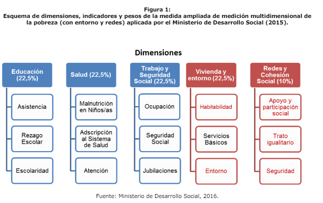

class: front

```{r eval=FALSE, include=FALSE}
# Correr esto para que funcione el infinite moonreader, el root folder debe ser static para si dirigir solo "bajndo" en directorios hacia el bib y otros

xaringan::inf_mr('/static/docpres/02_bases/2mlmbases.Rmd')

o en RStudio:
  - abrir desde carpeta root del proyecto
  - Addins-> infinite moon reader
```


```{r setup, include=FALSE, cache = FALSE}
require("knitr")
options(htmltools.dir.version = FALSE)
pacman::p_load(RefManageR)
# bib <- ReadBib("../../bib/electivomultinivel.bib", check = FALSE)
opts_chunk$set(warning=FALSE,
             message=FALSE,
             echo=FALSE,
             cache = FALSE #,fig.width=7, fig.height=5.2
             )
pacman::p_load(flipbookr, tidyverse)
```


```{r xaringanExtra, include=FALSE}
xaringanExtra::use_xaringan_extra(c("tile_view", "animate_css"))
xaringanExtra::use_scribble()
```

<!---
Para correr en ATOM
- open terminal, abrir R (simplemente, R y enter)
- rmarkdown::render('static/docpres/07_interacciones/7interacciones.Rmd', 'xaringan::moon_reader')

About macros.js: permite escalar las imágenes como [scale 50%](path to image), hay si que grabar ese archivo js en el directorio.
--->


.pull-left[
# R para el análisis de datos
## **Kevin Carrasco**
## Sociología - UAH
## 1er Sem 2024 
## [.green[R-data-analisis.netlify.com]](https://R-data-analisis.netlify.com)
] 


.pull-right[
.right[
<br>
## .yellow[Sesión 6: Índices y escalas]


]

]
---
class: inverse, bottom, right


# .red[Sesión 5]
<br>

.yellow[Repaso sesión anterior]

Índices

Escalas

<br>
<br>
<br>
<br>
---

layout: true
class: animated, fadeIn

---
class: inverse, center

<br>

## ¿Cómo puedo saber si una variable se encuentra asociada a otra variable?

--

### Si ambas varían de manera **similar** (covarían)

---
# Asociación: covarianza / correlación

.pull-left[
  _¿Se relaciona la variación de una variable, con la variación de otra variable?_
]
.pull-right[
.center[]
]

---
# Correlación

- Medida de co-variación lineal estandarizada

--

<br>
<br>
.center[¿En qué rango varía una correlación?]

--

- Varía entre -1 y +1

---

## Correlación

- Da cuenta de:

  - *Intesidad*: mientras más cercana a |1|, más intensa
  - *Sentido*: positiva o negativa

--

- Gráficamente se expresa en *nubes de puntos*

---

.center[]


---
class: inverse, bottom, right


# .red[Sesión 5]
<br>

Repaso sesión anterior

.yellow[Índices]

Escalas

<br>
<br>
<br>
<br>
---

## ¿Qué es un índice?

--

* Es una medida estadística que permite agregar una o más variables de **distinta** naturaleza para sintetizar la parte esencial de la información contenida en un fenómeno.

* Se utiliza para simplificar y resumir datos complejos en una forma más manejable y comprensible

---
## ¿Qué es un índice?

* Suelen tener un punto de referencia (por ejemplo, 100) que representa una línea base o un punto de comparación

--

* Pueden ser índices ponderados (distinto *peso* en cada dimensión y/o variable) o no ponderados (mismo *peso* en cada dimensión y/o variable). Depende de si las variables individuales tienen diferente importancia.

* Ejemplo: Índice de precios al consumidor; Índice de desarrollo humano

---
.pull-left-narrow[
### Ejemplo índice no ponderado]

.pull-right-wide[
.center[]
]
---
.pull-left-narrow[
### Ejemplo índice ponderado]


.center[]

---
class: inverse, bottom, right


# .red[Sesión 5]
<br>

Repaso sesión anterior

Índices

.yellow[Escalas]

<br>
<br>
<br>
<br>
---
## ¿Qué es una escala?

--

* Medida de una serie de categorías ordenadas que se utilizan para medir o calificar un atributo específico.

* Se construye generalmente combinando las respuestas o puntuaciones de diferentes variables en una sola medida.

* Cada variable puede contribuir de forma distinta a la evaluación general de un atributo, pero el objetivo principal sigue siendo medir un atributo en específico.

---

.pull-left-narrow[
### Ejemplo de escala]


.center[]


---

## Alfa de Chronbach

--

* Estadístico que permite estimar la **fiabilidad** de una escala por **consistencia interna**.

* Ventajas: Fácil de estimar

* Desventajas: 
  - Puede aumentar artificalmente al incorporar muchos ítems parecidos
  - Asume que el constructo es unidimensional
  - Es afectado por ítems, número de alternativas de respuesta y la varianza del test

---

## Alfa de Chronbach

* Para interpretarlo:

  - Mínimo para investigación básica exploratorio: >.7
  - Mínimo para investigación asociativa: >.8
  - Investigación con decisiones muy importantes: >.9
  
* A mayor valor, más consistente es la escala:

  - Mínimo a considerar: >0.6
---
class: inverse

# RESUMEN

- Correlación de Pearson

- Índices

- Escalas

---

class: front

.pull-left[
# R para el análisis de datos
## **Kevin Carrasco**
## Sociología - UAH
## 1er Sem 2024 
## [.green[R-data-analisis.netlify.com]](https://R-data-analisis.netlify.com)
] 


.pull-right[
.right[
<br>
## .yellow[Sesión 6: Índices y escalas]


]

]

